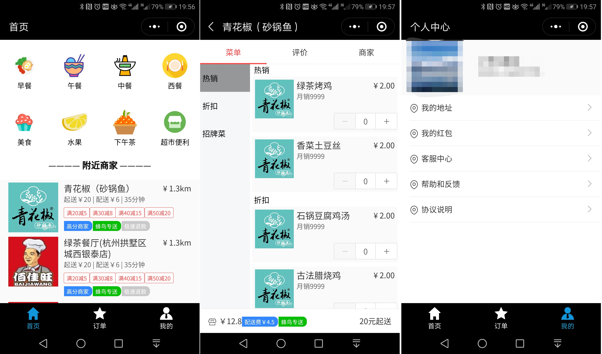

# Introduction

> 一步步搭建外卖平台

后台：

- `spring-cloud`
- `spring-security-oauth2`
- `MyBatis代码生成工具`：[GitHub](https://github.com/smilewangsy/wang-smile-common)

移动端：

- `微信小程序`

前台：

- `BootStrap`
- `thymeleaf`

文档生成工具：

- `swagger2`

> `january-member:`用户会员服务，端口: `18080`
>
> `january-merchant:`商户服务，端口: `18081`
>
> `january-order:`订单服务，端口: `18082`
>
> `data:`相关资料(如sql)
>
> `wechat:january-jhh`微信小程序
> 

## 运行效果

> `january-merchant:`商户服务，端口: `18081`
>
> 
> 
> 
> 